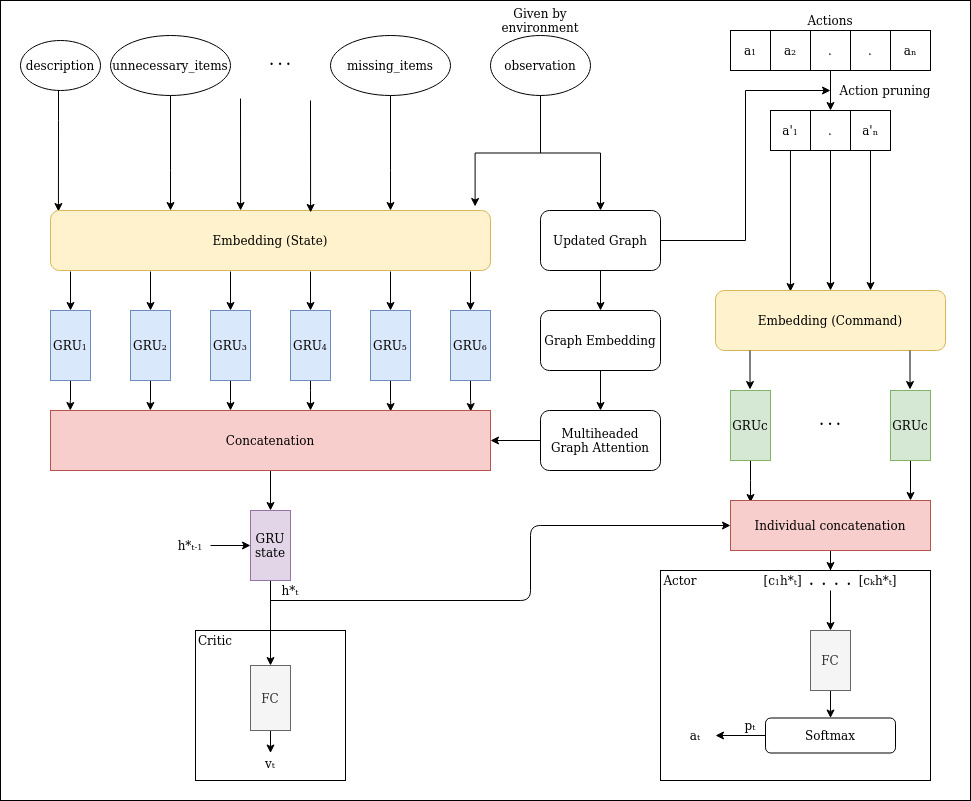

# Deep Reinforcement Learning Agent for Families of Text-Based Games

This work brings together the efforts of Narasimhan et al. and Adolphs et al. to tackle the task of building an AI agent that can play efficiently and win simplified text-based games. The problem statement is [*First TextWorld Problems: A Reinforcement and Language Learning Challenge*](https://www.microsoft.com/en-us/research/project/textworld/).

## Architecture
Our approach leverages Knowledge Graph, Stanford OpenIE triples, Graph Attention and Advantage Actor Critic Network.

